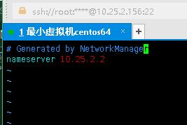

### 在Vmware中分开虚拟机和外网机器两个网段，可以使用VMware的NAT网络连接模式，设置静态IP

#### 1. 设置本地网络
 

#### 2.  设置虚拟机网络
  虚拟机菜单  编辑-->虚拟网络编辑器
  
  
  注意**网关**设置不能与**子网IP**和本机**Vmnet8的IP**重复
  

#### 3. 设置虚拟机网络
1. 设置虚拟机IP 修改 /etc/sysconfig/network-scripts/ifcfg-ens33 
2. 
3. 修改 /etc/resolv.conf
4. 
5. 重启网络
6.  ```systemctl restart network.service 或者 service network restart```
7.  验证
